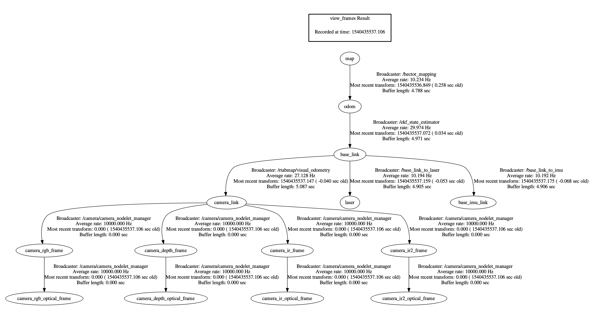
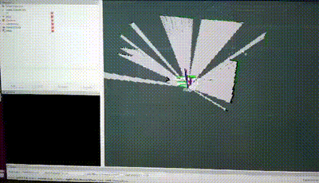
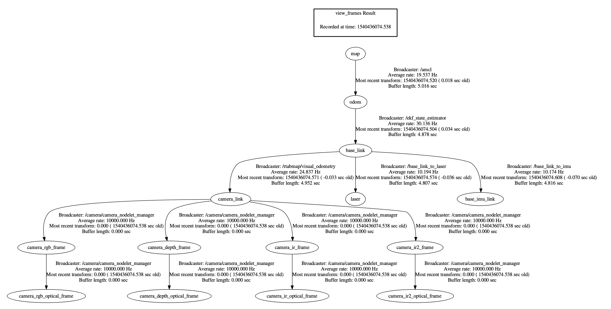

# Big T Robot ROS Navigation

Big T is an autonomous three-wheeled omni-wheel holonomic robot with SLAM capabilities.

This repo holds the control code for this omnidirectional robot incorporating sensor feedback from both exterioceptive sensors such as mouse sensor, LIDAR and Intel RealSense and proprioceptive sensors such as IMU and encoders used to capture odometry signals to inform the control algorithm.

There are two main mapping modes we can operate in with Big T.

1. We first create the map of the environment using Hector SLAM to simulataneously localise and map the environment and save the map. See [here](http://wiki.ros.org/hector_slam) for ref.

This example below shows the robot performing autonomous SLAM to map the environment.

Hector SLAM is used in conjunction with an extended Kalman filter (EKF) to fuse wheel odometry with IMU to create an improved odometry estimate. The following diagram shows the RPS coordinate frames in the hector mapping setup.

2. We can test localising the robot inside the saved map using AMCL (Adaptive Monte Carlo localisation) which estimates 2D position based on particle filter. The robot's pose is represented as a distribution of particles, where each particle represents a possible pose of the robot. It takes as input a map, LIDAR scans, and transform messages, and outputs an estimated pose. See [here](http://wiki.ros.org/amcl) for more details.

The coordinate frames between all the package nodes for AMCL is shown below.

Big T can be run into two operative modes, high level block digrams are shown below:

1. Autonomous Mode - this mode is often used for SLAM navigation.

2. Tele-operative Mode - this mode is often used for user-controlled navigation in a saved map and also for debugging purposes.

This project was executed as part of the course - ECEN430: Advanced Mechatronic Engineering 2: Intelligence and Design at Victoria University of Wellington.