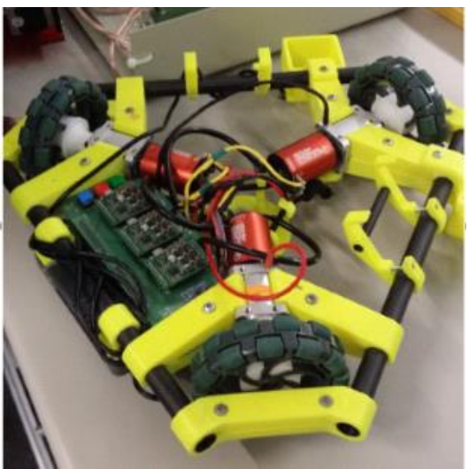
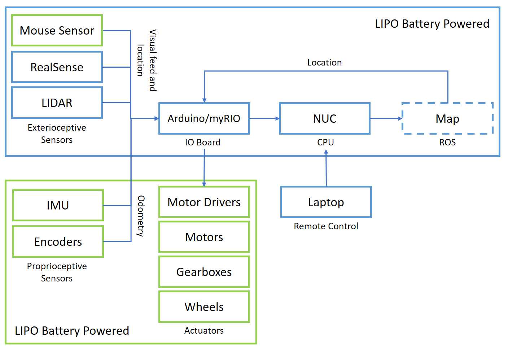
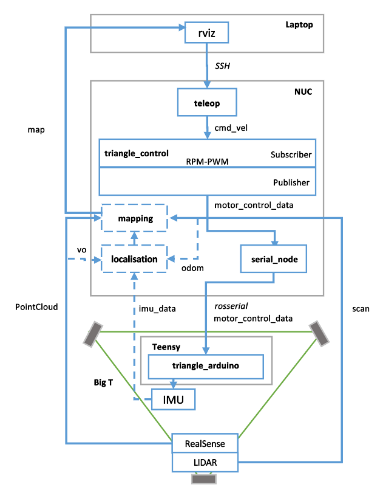
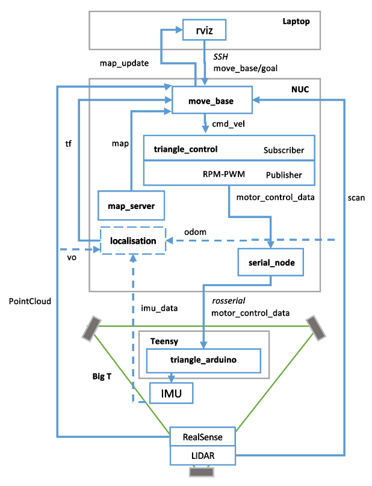

# Big T Robot ROS Navigation

Big T is an autonomous three-wheeled omni-wheel holonomic robot capable of instantaneously changing direction of motion without having to perform intermediate rotation steps. 

This repo holds the control code for this omnidirectional robot incorporating sensor feedback from both exterioceptive sensors such as mouse sensor, LIDAR and Intel RealSense and proprioceptive sensors such as IMU and encoders used to capture odometry signals to inform the control algorithm.

Big T can be run into two modes, high level block digrams are shown below:
1. Tele-operative Mode

2. Autonomous Mode

This project was executed as part of the course - ECEN430: Advanced Mechatronic Engineering 2: Intelligence and Design at Victoria University of Wellington.